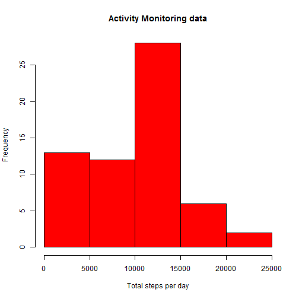
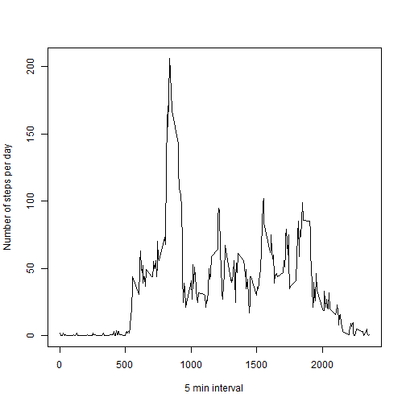
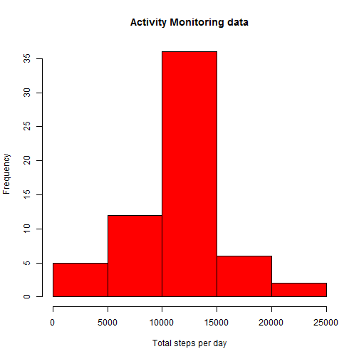
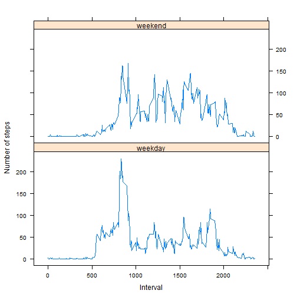

##Introduction

In this report, we aim to analyze the activity patterns data and identify the impact, if any, that missing values have in overall analysis. We also intend to discover the activity pattern differences between weekdays and weekends.

The data of this analysis contains information about number of steps taken, collected all-day at 5 minute intervals from an individual through a personal activity monitoring device, collected during the months of October and November 2012.

##Loading and preprocessing the data

First, we load this data (stored as a comma-separated-value file) into R as below. We accommodate for header information present in our dataset.


```r
activityData <- read.csv("activity.csv", header=TRUE)
```

We then look at the structure of this data - to note the number of fields, names of each field, sample field values etc.


```r
str(activityData)
```

```
## 'data.frame':	17568 obs. of  3 variables:
##  $ steps   : int  NA NA NA NA NA NA NA NA NA NA ...
##  $ date    : Factor w/ 61 levels "2012-10-01","2012-10-02",..: 1 1 1 1 1 1 1 1 1 1 ...
##  $ interval: int  0 5 10 15 20 25 30 35 40 45 ...
```

In the following sections, we analyze this data and try to find answers to some key questions.

##What is mean total number of steps taken per day?

We now compute the total number steps taken each day and plot a histogram of the same. 

Note that for this purpose and subsequent sections unless specified, we ignore the entries with missing values from the dataset.


```r
totalStepsPerDay <- ddply(activityData, .(date), summarize, total=sum(steps, na.rm = TRUE))
```
 

The **mean** total number of steps is calculated as below 


```r
mean(totalStepsPerDay$total)
```

```
## [1] 9354.23
```

and the **median** total number of steps as below. Note that we are still operating on the data after ignoring missing values.


```r
median(totalStepsPerDay$total)
```

```
## [1] 10395
```

##What is the average daily activity pattern?

To analyze the activity pattern, We will now calculate the average number of steps taken for a 5-minute interval across all days. And then, we draw a time series plot of the 5-minute interval against the average number of steps.


```r
meanStepsAcrossDays <- ddply(activityData, .(interval), summarize, avgSteps= round(mean(steps, na.rm = TRUE)))
```

 

The peak point of this graph, that is, the 5-minute interval that contains the maximum number of steps taken by the individual, averaged across all days can be computed as below. 


```r
meanStepsAcrossDays[which.max(meanStepsAcrossDays[,2]),1]
```

```
## [1] 835
```

##Imputing missing values

Note that there are a number of days/intervals where there are missing values (coded as NA). The presence of missing days may introduce bias into some calculations or summaries of the data.

We will now find out how many values are missing in the dataset.


```r
sum(is.na(activityData[,1]))
```

```
## [1] 2304
```

We will now try to replace the missing values with mean value for that interval to get rid of NAs. 

This is achieved by first joining the 2 datasets - the original dataset with the one where we computed mean for every interval. After joining, we replace 'missing' number of steps with mean for that interval. We pick only required fields and create a new dataset that has all missing values filled in.


```r
joinedSet <- join(activityData, meanStepsAcrossDays, by = "interval", type = "inner")
joinedSet[is.na(joinedSet$steps),1] <- joinedSet[is.na(joinedSet$steps), 4]
activityDataWithNoNAs <- joinedSet[,1:3]
```

We repeat all steps from our **What is mean total number of steps taken per day** section now, with this new dataset.

First, we calculate the total number of steps taken each day and plot a histogram of the same


```r
totalStepsPerDayNoNAs <- ddply(activityDataWithNoNAs, .(date), summarize, total=sum(steps))
```

 

Next, we compute the **mean** of number of steps taken in a day


```r
mean(totalStepsPerDayNoNAs$total)
```

```
## [1] 10765.64
```

and the **median** of number of steps taken in a day


```r
median(totalStepsPerDayNoNAs$total)
```

```
## [1] 10762
```

From the values, it can be seen that imputing missing values has increased the estimates for both mean and median from the earlier estimate. 

##Are there differences in activity patterns between weekdays and weekends?

In this section, we will find out if there are differences in activity patterns between weekdays and weekends. To identify the same, we add another field to our dataset with value populated appropriately as 'weekday' or 'weekend'. 


```r
activityDataWithNoNAs$weekDay <- factor(weekdays(strptime(activityDataWithNoNAs$date, "%Y-%m-%d")) 
%in% c("Saturday", "Sunday"), labels = c("weekday", "weekend"))
```

Using this dataset, we now compute the average number of steps for every 5-minute interval, averaged across weekdays and weekends separately and plotted in a panel plot as shown below


```r
meanStepsWeekDays <- ddply(activityDataWithNoNAs, .(interval,weekDay), summarize
, avgSteps= round(mean(steps, na.rm = TRUE)))
```

 

